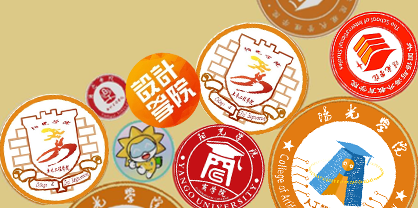
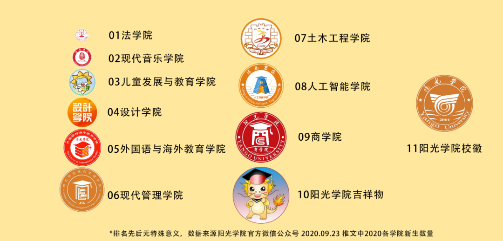

# 合成大阳光

最近有一款叫做『 合成大西瓜 』的游戏风靡全国，想必大家都有了解过，一但上手那是一个真香，打发时间利器。

前不久这款游戏的源代码也在 [Github](https://github.com/liyupi/daxigua) 上流传开来，大家都开始 DIY了来，我也搞了一个来玩，就叫做 **#合成大阳光**: 

你能认出9大学院吗？

**玩法介绍：**

玩法和原版大西瓜一样，不过瓜可没了，游戏中的各种水果被换成了我们阳光学院9大学院的的标志：

默认分数增值修改为了10分。

原”合成大西瓜“源码地址：https://github.com/liyupi/daxigua

鱼皮大佬教程：https://mp.weixin.qq.com/s/H9VR1MWn-9bKSC_1l_MkJw

